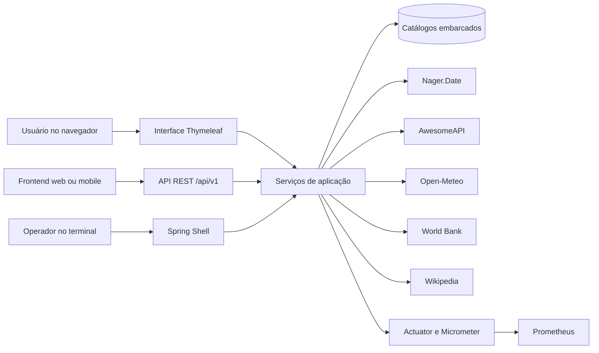
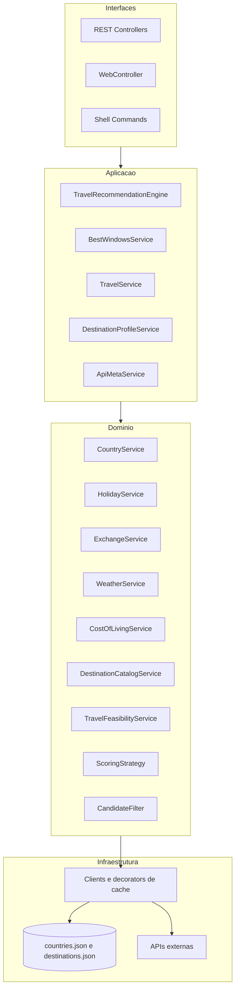
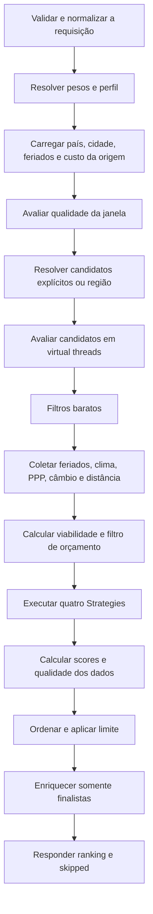

# Arquitetura da API

## 1. Objetivo e limites

O Planejador de Feriadões é uma aplicação Spring Boot 3.5, executada em Java 21, que transforma calendários, clima, custo relativo, distância e contexto do destino em recomendações explicáveis de viagens curtas.

O produto é um sistema de apoio à decisão, não uma agência de viagens. Ele:

- encontra boas janelas no calendário da origem;
- compara países explícitos ou todos os países independentes de uma região;
- separa qualidade da janela, qualidade do destino e confiança dos dados;
- estima esforço de deslocamento e gastos terrestres;
- expõe as premissas, critérios ausentes e destinos descartados.

Ele não reserva viagens nem inventa preços comerciais. Passagens, hospedagem cotada, seguro e requisitos de entrada permanecem fora da estimativa enquanto não houver provedores próprios e confiáveis.

## 2. Contexto do sistema



As três interfaces usam os mesmos serviços de domínio. A API REST é o contrato principal para novas interfaces; a página Thymeleaf oferece uma experiência pronta para uso e o Spring Shell mantém o acesso por terminal.

## 3. Organização interna



Os pacotes são organizados por capacidade de negócio (`country`, `holiday`, `weather`, `recommendation`, `destination`, `enrichment`), evitando uma separação puramente técnica que espalharia cada caso de uso por todo o projeto.

## 4. Fluxo de recomendação



Falhas em clima, custo ou câmbio degradam apenas o critério correspondente. Um candidato só é descartado quando faltam dados essenciais, quando viola uma restrição explícita ou quando excede o orçamento terrestre informado. A falha de um candidato não interrompe o ranking.

### 4.1 Cálculo das notas

Cada `ScoringStrategy` devolve uma nota de 0 a 100 ou marca o critério como indisponível. Os pesos dos critérios disponíveis são renormalizados:

```text
destinationScore = Σ(notaDoCritério × pesoEfetivo)
pesoEfetivo      = pesoConfigurado / Σ(pesos dos critérios disponíveis)
coverage          = Σ(pesos configurados dos critérios disponíveis)
combined          = 0,80 × destinationScore + 0,20 × windowScore
tripScore         = combined × (0,75 + 0,25 × coverage)
```

Assim, a falta de um dado não transforma sua nota em zero artificialmente, mas reduz a confiança e a nota final. `DataQuality` publica cobertura, confiança, quantidade de critérios medidos e a lista de dados ausentes.

### 4.2 Critérios

| Critério | Implementação | Informação usada |
|---|---|---|
| Clima | `WeatherStrategy` | Temperatura, chuva e variabilidade |
| Custo | `CostOfLivingStrategy` | Nível de preços relativo calculado por PPP |
| Distância | `DistanceStrategy` | Distância Haversine entre cidades de referência |
| Festividades | `DestinationFestivitiesStrategy` | Feriados públicos no destino durante a janela |

O câmbio nominal é informativo e não compõe o ranking, pois uma unidade monetária barata não significa baixo custo de vida.

### 4.3 Clima e viabilidade

Janelas inteiramente dentro dos próximos 16 dias usam previsão da Open-Meteo. Janelas mais distantes usam climatologia dos mesmos dias do calendário nos dez anos anteriores.

O custo terrestre é uma estimativa de baixa confiança, baseada em:

```text
custoDiárioDestino =
    baseDiáriaNaOrigem × nívelDePreçosDestino / nívelDePreçosOrigem

custoTotal = custoDiárioDestino × dias × viajantes
```

A resposta sempre informa a premissa, os anos econômicos utilizados e os itens não incluídos. O tempo de deslocamento é uma aproximação derivada da distância, não um itinerário real.

## 5. Fontes e degradação

| Fonte | Uso | Cache | Proteção | Comportamento em falha |
|---|---|---:|---|---|
| mledoze/countries | Países, regiões e moedas | Arquivo estático + 24 h | Não depende de rede | Catálogo permanece disponível |
| Wikidata | Capitais, coordenadas e UTC | Arquivo estático | Não depende de rede | Usa fallback geográfico do país |
| Nager.Date | Feriados | 12 h | Retry, circuit breaker e bulkhead | Candidato pode ser descartado se o calendário essencial faltar |
| AwesomeAPI | Câmbio nominal | 5 min | Retry, circuit breaker e bulkhead | Resposta continua sem câmbio |
| Open-Meteo | Previsão e histórico | 7 dias | Retry, circuit breaker e bulkhead | Critério de clima fica indisponível |
| World Bank | PPP, câmbio oficial e população | 7 dias | Retry, circuit breaker e bulkhead | Custo, estimativa ou população podem ficar ausentes |
| Wikipedia | Resumo, imagem e link | 30 dias, inclusive negativo | Retry, circuit breaker e bulkhead | Ranking continua sem conteúdo editorial |

Os estados de resiliência são independentes por provedor. Isso impede, por exemplo, que uma falha da Wikipédia abra o circuito do Banco Mundial.

## 6. Contratos expostos

Todos os `@RestController` recebem automaticamente o prefixo `/api/v1`.

| Endpoint | Finalidade |
|---|---|
| `GET /api/v1/recommendations` | Busca compatível via query string |
| `POST /api/v1/recommendations` | Busca estruturada recomendada para frontend |
| `GET /api/v1/recommendations/best-windows` | Descoberta de feriadões e pontes |
| `GET /api/v1/meta` | Países, cidades, limites, perfis, critérios e capacidades |
| `GET /api/v1/travel/{code}` | Visão agregada de um país |
| `GET /api/v1/countries/**` | Consulta de países |
| `GET /api/v1/holidays/**` | Consulta de feriados |
| `GET /api/v1/exchange/**` | Consulta de câmbio |
| `GET /v3/api-docs` | Contrato OpenAPI |
| `GET /swagger-ui.html` | Exploração interativa da API |

Erros usam um único `ApiError`, com código estável, `traceId`, caminho e violações de campo quando aplicável. O mesmo identificador aparece no header `X-Trace-Id`.

## 7. Aspectos operacionais

Antes dos controllers, a requisição passa por:

1. `RequestTraceFilter`, que cria ou valida a correlação;
2. `SecurityHeadersFilter`, que adiciona os headers de proteção;
3. `RateLimitFilter`, aplicado à API, com Bucket4j e armazenamento Caffeine limitado.

O rate limit usa o endereço remoto por padrão. `X-Forwarded-For` só é aceito quando a aplicação está explicitamente configurada atrás de um proxy confiável.

Actuator expõe somente `health`, `info` e `prometheus`. As métricas do motor têm cardinalidade controlada e medem duração, sucesso, candidatos avaliados e resultados entregues.

A distribuição é reproduzível por:

- JAR executável com shutdown gracioso e compressão HTTP;
- Dockerfile multi-stage, JRE 21 e usuário não-root;
- GitLab CI com estágios de teste, pacote e imagem de contêiner.

## 8. Padrões de projeto

| Padrão | Aplicação | Benefício |
|---|---|---|
| Strategy | `ScoringStrategy` e quatro critérios | Permite evoluir critérios sem alterar o motor |
| Decorator | `Caching*Client` | Adiciona cache sem contaminar clients ou serviços |
| Chain of Responsibility | `CandidateFilterChain` | Compõe restrições obrigatórias com motivos explícitos |
| Facade | `TravelService` e `DestinationProfileService` | Oculta a coordenação de múltiplas fontes |

`TravelRecommendationEngine` atua como orquestrador do caso de uso. Ele não é tratado como uma regra de domínio isolada: coordena serviços, paralelismo, degradação, scoring e enriquecimento.

## 9. Estratégia de testes

A suíte padrão possui **196 testes backend sem rede** (201 com o perfil Maven `integration`):

- unitários para serviços, estratégias, filtros, cálculos e decorators;
- testes MVC para contratos, validação, CORS, erros e headers;
- testes de contexto para configuração, métricas, health e OpenAPI;
- testes de integração externos, marcados com `@Tag("integration")`, executados apenas pelo perfil Maven `integration`.

O padrão sem rede mantém a suíte determinística. Os smoke tests externos verificam compatibilidade com provedores, mas não são requisito para cada execução local.

## 10. Limites e extensões

- A estimativa terrestre por PPP não substitui cotações de hospedagem, alimentação ou transporte.
- Passagens, vistos, vacinas, seguro e regras de entrada não são avaliados.
- A climatologia representa tendência histórica, não previsão meteorológica.
- Distância e duração não consideram malha aérea, conexões ou disponibilidade de rotas.
- Caches, circuit breakers e buckets são locais ao processo. Em múltiplas réplicas, cada instância mantém seu próprio estado.

Extensões naturais são clients opcionais para preços comerciais e requisitos de entrada. Esses dados devem entrar como novas fontes com proveniência, validade e confiança explícitas, preservando a degradação parcial do motor.
