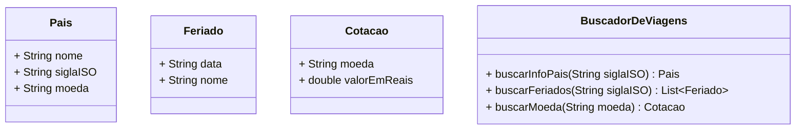

# Arquitetura e Modelagem do Sistema

## Testes para UML com mermaid

```mermaid

classDiagram
    class Pais{
        + String nome
        + String siglaISO
        + String moeda
    }

    class Feriado{
        + String data
        + String nome
    }

    class Cotacao{
        + String moeda
        + double valorEmReais
    }

    class BuscadorDeViagens{
        + buscarInfoPais(String siglaISO) Pais
        + buscarFeriados(String siglaISO) List~Feriado~
        + buscarMoeda(String moeda) Cotacao
    }
```

